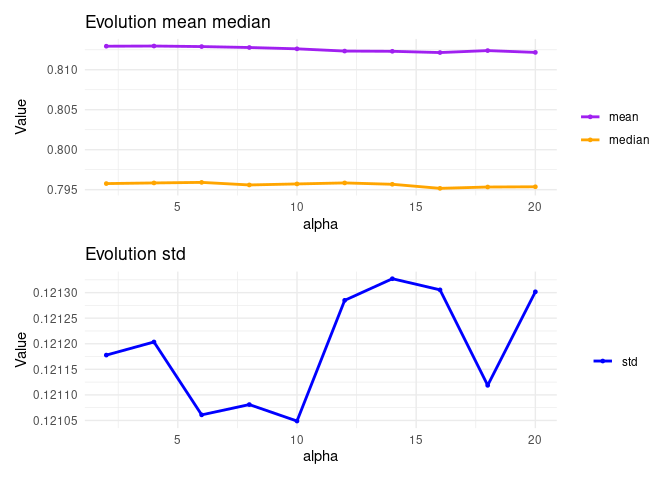

CDB_cycles_AnalysisOfParameters
================

In this notebook, we are studying the different parameters of our method
Complexity Driven Bagging so as to offer a range of selection to the
final user. In particular, we have three parameters:

-   Split: the number of splits in which we cut the complexity spectrum.
    s=1 implies we are training with one easy sample, one uniform sample
    and one hard sample. That is, the cycle length is 3. s=2 implies 6
    samples of different complexity (cycle length is 6).

-   Alpha: to give more weight to the easiest and the hardest instances
    in the bootstrap sampling procedure with the aim of training the
    classifier with samples of higher or lower complexity (thus,
    enlarging the original range of complexity).

-   Number of cycles. How many times the procedure is repeated. This is
    totally related with the final number of ensembles.

Besides these 3 parameters, we have obtained results for different
complexity measures. For the analysis of the parameters, we have
aggregated results over the different complexity measures.

First, we are studying the recommended number of cycles. That is, given
a value of split and a value of alpha, we want to know when the best
accuracy is obtained, when there are significant differences, etc. so as
to recommend the lower number of cycles (lower number of ensembles) with
the best performance.

Once the number of cycles is reduced, we perform a similar analysis on
the alpha parameter and on the split parameter.

# First view

``` r
library(tidyverse)
```

    ── Attaching packages ─────────────────────────────────────── tidyverse 1.3.2 ──
    ✔ ggplot2 3.5.1     ✔ purrr   1.0.2
    ✔ tibble  3.2.1     ✔ dplyr   1.1.4
    ✔ tidyr   1.3.1     ✔ stringr 1.5.1
    ✔ readr   2.1.2     ✔ forcats 0.5.2
    ── Conflicts ────────────────────────────────────────── tidyverse_conflicts() ──
    ✖ dplyr::filter() masks stats::filter()
    ✖ dplyr::lag()    masks stats::lag()

``` r
library(ggpubr)
library(rstatix)
```


    Attaching package: 'rstatix'

    The following object is masked from 'package:stats':

        filter

``` r
library(datarium)
library(DT)
library(ggplot2)
library(patchwork)

getwd()
```

    [1] "/home/carmen/PycharmProjects/EnsemblesComplexity/Results_general_algorithm_cycles"

``` r
setwd("/home/carmen/PycharmProjects/EnsemblesComplexity/Results_general_algorithm_cycles")
#datos <- read.csv('TotalAggregatedResults_ParameterConfiguration_CDB.csv') 
# Data aggregated over complexity measures
datos <- read.csv('df_summary_data.csv') 
str(datos)
```

    'data.frame':   156040 obs. of  9 variables:
     $ Dataset             : chr  "WineQualityRed_5vs6" "WineQualityRed_5vs6" "WineQualityRed_5vs6" "WineQualityRed_5vs6" ...
     $ n_cycle             : int  1 1 1 1 1 1 1 1 1 1 ...
     $ n_ensemble          : int  2 2 2 2 2 2 2 2 2 2 ...
     $ alpha               : int  2 4 6 8 10 12 14 16 18 20 ...
     $ split               : int  1 1 1 1 1 1 1 1 1 1 ...
     $ accuracy_mean_mean  : num  0.731 0.73 0.735 0.733 0.729 ...
     $ accuracy_mean_median: num  0.728 0.726 0.731 0.735 0.735 ...
     $ accuracy_mean_std   : num  0.00857 0.01481 0.01139 0.01202 0.01402 ...
     $ combo_alpha_split   : chr  "alpha2-split1" "alpha4-split1" "alpha6-split1" "alpha8-split1" ...

``` r
# Convert id and time into factor variables
datos <- datos %>%
  convert_as_factor(Dataset, combo_alpha_split, n_cycle,n_ensemble)
```

### Mean, median and standard deviation of accuracy for all levels of split

``` r
table_split <- datos %>%
  group_by(split) %>%
  summarise_at(vars(accuracy_mean_mean),  list(mean = mean, median = median, std = sd))
knitr::kable(table_split)
```

| split |      mean |    median |       std |
|------:|----------:|----------:|----------:|
|     1 | 0.8110460 | 0.7967871 | 0.1212139 |
|     2 | 0.8125088 | 0.7959839 | 0.1212647 |
|     4 | 0.8129489 | 0.7946452 | 0.1213289 |
|     6 | 0.8131103 | 0.7943984 | 0.1213001 |
|     8 | 0.8133743 | 0.7939779 | 0.1211680 |
|    10 | 0.8134900 | 0.7944709 | 0.1211299 |
|    12 | 0.8135405 | 0.7943101 | 0.1210803 |
|    14 | 0.8136284 | 0.7938616 | 0.1211058 |
|    16 | 0.8137780 | 0.7937970 | 0.1209858 |
|    18 | 0.8137304 | 0.7939759 | 0.1210338 |
|    20 | 0.8138354 | 0.7942397 | 0.1210338 |
|    22 | 0.8136747 | 0.7941315 | 0.1210665 |
|    24 | 0.8139666 | 0.7938021 | 0.1209256 |
|    26 | 0.8138905 | 0.7943179 | 0.1210517 |
|    28 | 0.8140333 | 0.7946578 | 0.1208977 |
|    30 | 0.8140107 | 0.7944929 | 0.1209749 |


The higher the value of split, the higher the mean (with some
exceptions) of accuracy, the lower the median and the lower the standard
deviation. ¿Medium-low split values?

If we compare if there are significant differences among the different
split values (once aggregated per n_cycle). We obtain that:

For the **mean of the accuracy**, there are no significant differences
among:

-   4 with 6, 6 with 8 and 12

-   8 with 12,14,16

-   10 with 12, 14, 18, 22

-   12 with 14, 16, 18, 20, 22

-   14 with 16, 18, 20, 22, 26

-   From 16 to 30, almost all comparisons are not significantly
    different –\> maximum value of split should be 16

For the **median of the accuracy**, there are no significant differences
among:

-   4 with 6 and 10

-   6 with 8, 10, 12

-   8 with 10, 12, 14, 16, 18, 20, 22

-   10 with 12, 14, 16, 18, 20, 22

-   12 with 14, 16, 18, 20, 22

-   14 with 16, 18, 20, 22, 26

-   From 16 to 30, almost all comparisons are not significantly
    different –\> maximum value of split should be 16

For the **std of the accuracy**, there are no significant differences
among:

-   4 with 6 and 8

-   6 with 8, 10, 12

-   8 with 10, 12, 14, 16, 20

-   10 with 12, 14, 16, 20, 22, 30

-   12 with 14, 16, 20, 22, 26, 30

-   From 14 to 30, almost all comparisons are not significantly
    different –\> maximum value of split should be 16

### Mean, median and standard deviation of accuracy for all levels of alpha

``` r
table_alpha <- datos %>%
  group_by(alpha) %>%
  summarise_at(vars(accuracy_mean_mean),  list(mean = mean, median = median, std = sd))
knitr::kable(table_alpha)
```

| alpha |      mean |    median |       std |
|------:|----------:|----------:|----------:|
|     2 | 0.8129428 | 0.7957598 | 0.1211778 |
|     4 | 0.8129658 | 0.7958410 | 0.1212035 |
|     6 | 0.8128979 | 0.7959097 | 0.1210609 |
|     8 | 0.8127810 | 0.7955892 | 0.1210810 |
|    10 | 0.8126166 | 0.7957162 | 0.1210488 |
|    12 | 0.8123364 | 0.7958433 | 0.1212849 |
|    14 | 0.8123072 | 0.7956720 | 0.1213272 |
|    16 | 0.8121494 | 0.7951638 | 0.1213054 |
|    18 | 0.8123956 | 0.7953308 | 0.1211186 |
|    20 | 0.8121692 | 0.7953601 | 0.1213016 |



The higher the value of alpha, the lower the mean and the median of
accuracy. The standard deviation keeps lower for low-medium values. –\>
Low-medium values of alpha. Lower than 12.

If we compare if there are significant differences among the different
alpha values (once aggregated per n_cycle). We obtain that:

For the **mean of the accuracy**, there are ONLY significant differences
among:

-   2 with 10

-   10 with 12, 14, 16, 18, 20

For the **median of the accuracy**, there are ONLY significant
differences among:

-   2 with 4, 6, 8, 10, 14

-   10 with 12, 16, 20

For the **std of the accuracy**, there are NO significant differences
among:

-   4 with 6 and 8

-   6 with 8, 10, 12

-   8 with 10, 12

-   From 10 to 20, almost all comparisons are not significantly
    different –\> maximum value of alpha should be 10

### Mean, median and standard deviation of accuracy for all levels of n_cycles (for some split values)

We cannot perform a summary of ‘n_cycle’ in general because the number
of cycles depends on the value of split. Thus, we show some cases.

**split = 1**

``` r
table_split1 <- datos %>% filter(split == 1) %>%
  group_by(n_cycle) %>%
  summarise_at(vars(accuracy_mean_mean),  list(mean = mean, median = median, std = sd))
knitr::kable(table_split1)
```

| n_cycle |      mean |    median |       std |
|:--------|----------:|----------:|----------:|
| 1       | 0.7756790 | 0.7591390 | 0.1335892 |
| 2       | 0.7859496 | 0.7744528 | 0.1303084 |
| 3       | 0.7970600 | 0.7860915 | 0.1266214 |
| 4       | 0.7994771 | 0.7875739 | 0.1258194 |
| 5       | 0.8029400 | 0.7898607 | 0.1245428 |
| 6       | 0.8037183 | 0.7907027 | 0.1243518 |
| 7       | 0.8059178 | 0.7915995 | 0.1233060 |
| 8       | 0.8065337 | 0.7929174 | 0.1230520 |
| 9       | 0.8075320 | 0.7934322 | 0.1226671 |
| 10      | 0.8078526 | 0.7934658 | 0.1225563 |
| 11      | 0.8085271 | 0.7943898 | 0.1222828 |
| 12      | 0.8087429 | 0.7941222 | 0.1223141 |
| 13      | 0.8092267 | 0.7945299 | 0.1220799 |
| 14      | 0.8093845 | 0.7946952 | 0.1220494 |
| 15      | 0.8097374 | 0.7951246 | 0.1218240 |
| 16      | 0.8099223 | 0.7949990 | 0.1218300 |
| 17      | 0.8102507 | 0.7952207 | 0.1216323 |
| 18      | 0.8105223 | 0.7958553 | 0.1214596 |
| 19      | 0.8106788 | 0.7953371 | 0.1214272 |
| 20      | 0.8107571 | 0.7950385 | 0.1213842 |
| 21      | 0.8109622 | 0.7958051 | 0.1212865 |
| 22      | 0.8109908 | 0.7961829 | 0.1212791 |
| 23      | 0.8112208 | 0.7960142 | 0.1212699 |
| 24      | 0.8113277 | 0.7959811 | 0.1211238 |
| 25      | 0.8114490 | 0.7956136 | 0.1211408 |
| 26      | 0.8115016 | 0.7960230 | 0.1211391 |
| 27      | 0.8116710 | 0.7959297 | 0.1209756 |
| 28      | 0.8116816 | 0.7963127 | 0.1210195 |
| 29      | 0.8118198 | 0.7964280 | 0.1209704 |
| 30      | 0.8118466 | 0.7961231 | 0.1209071 |
| 31      | 0.8119325 | 0.7966748 | 0.1209119 |
| 32      | 0.8120285 | 0.7968614 | 0.1208236 |
| 33      | 0.8120469 | 0.7969262 | 0.1208331 |
| 34      | 0.8120727 | 0.7968393 | 0.1208331 |
| 35      | 0.8121428 | 0.7971642 | 0.1207984 |
| 36      | 0.8122442 | 0.7970744 | 0.1207836 |
| 37      | 0.8122955 | 0.7967401 | 0.1206765 |
| 38      | 0.8123182 | 0.7968937 | 0.1206443 |
| 39      | 0.8123705 | 0.7970083 | 0.1205937 |
| 40      | 0.8123626 | 0.7970500 | 0.1206607 |
| 41      | 0.8123521 | 0.7971789 | 0.1206786 |
| 42      | 0.8124012 | 0.7973908 | 0.1207203 |
| 43      | 0.8124386 | 0.7970934 | 0.1206390 |
| 44      | 0.8124917 | 0.7976081 | 0.1206672 |
| 45      | 0.8126015 | 0.7972997 | 0.1205904 |
| 46      | 0.8125787 | 0.7974742 | 0.1206267 |
| 47      | 0.8126099 | 0.7981018 | 0.1206047 |
| 48      | 0.8126412 | 0.7974160 | 0.1205582 |
| 49      | 0.8126142 | 0.7976274 | 0.1206082 |
| 50      | 0.8126496 | 0.7971792 | 0.1205949 |
| 51      | 0.8126936 | 0.7973646 | 0.1206044 |
| 52      | 0.8126897 | 0.7972023 | 0.1206168 |
| 53      | 0.8127480 | 0.7972210 | 0.1205667 |
| 54      | 0.8127801 | 0.7973761 | 0.1205324 |
| 55      | 0.8128307 | 0.7970356 | 0.1205376 |
| 56      | 0.8129148 | 0.7974204 | 0.1204809 |
| 57      | 0.8129611 | 0.7974561 | 0.1204807 |
| 58      | 0.8129984 | 0.7975191 | 0.1204710 |
| 59      | 0.8129814 | 0.7973425 | 0.1204628 |
| 60      | 0.8129268 | 0.7970889 | 0.1204369 |
| 61      | 0.8129403 | 0.7973984 | 0.1204499 |
| 62      | 0.8129809 | 0.7975005 | 0.1204287 |
| 63      | 0.8129665 | 0.7972464 | 0.1204683 |
| 64      | 0.8129417 | 0.7974337 | 0.1205009 |
| 65      | 0.8129671 | 0.7976248 | 0.1204499 |
| 66      | 0.8129913 | 0.7976016 | 0.1204484 |
| 67      | 0.8129390 | 0.7976989 | 0.1204725 |
| 68      | 0.8129920 | 0.7976058 | 0.1204102 |
| 69      | 0.8129712 | 0.7978455 | 0.1205171 |
| 70      | 0.8130038 | 0.7980463 | 0.1204603 |
| 71      | 0.8129974 | 0.7982311 | 0.1204690 |
| 72      | 0.8130344 | 0.7980669 | 0.1204248 |
| 73      | 0.8130781 | 0.7981644 | 0.1204235 |
| 74      | 0.8130691 | 0.7979457 | 0.1204334 |
| 75      | 0.8131017 | 0.7983264 | 0.1204169 |
| 76      | 0.8130674 | 0.7980832 | 0.1204308 |
| 77      | 0.8130863 | 0.7981275 | 0.1204443 |
| 78      | 0.8131161 | 0.7980625 | 0.1203965 |
| 79      | 0.8130629 | 0.7979155 | 0.1204396 |
| 80      | 0.8130626 | 0.7979968 | 0.1203842 |
| 81      | 0.8131001 | 0.7981658 | 0.1203663 |
| 82      | 0.8131419 | 0.7982563 | 0.1203453 |
| 83      | 0.8131550 | 0.7978702 | 0.1203282 |
| 84      | 0.8131063 | 0.7979332 | 0.1203814 |
| 85      | 0.8131826 | 0.7984805 | 0.1203830 |
| 86      | 0.8131811 | 0.7983165 | 0.1204275 |
| 87      | 0.8131718 | 0.7987177 | 0.1204139 |
| 88      | 0.8131923 | 0.7983681 | 0.1203962 |
| 89      | 0.8132136 | 0.7983247 | 0.1203777 |
| 90      | 0.8132081 | 0.7984851 | 0.1203830 |
| 91      | 0.8131905 | 0.7982224 | 0.1203960 |
| 92      | 0.8131368 | 0.7983780 | 0.1203972 |
| 93      | 0.8132379 | 0.7979346 | 0.1203632 |
| 94      | 0.8131966 | 0.7979371 | 0.1203722 |
| 95      | 0.8132150 | 0.7985201 | 0.1203570 |
| 96      | 0.8132221 | 0.7984918 | 0.1203692 |
| 97      | 0.8131727 | 0.7982352 | 0.1203869 |
| 98      | 0.8131899 | 0.7982940 | 0.1203663 |
| 99      | 0.8132345 | 0.7982095 | 0.1203836 |
| 100     | 0.8131859 | 0.7980677 | 0.1203859 |

``` r
#datatable(table_split1)
```


The higher the number of cycles, the higher the mean, median of accuracy
and the lower the standard deviation. For high values of cycles, the
accuracy clearly stabilizes and there is no always a clear increase over
time. For example, results with 89 cycles are better than with 100.

**split = 2**

``` r
table_split2 <- datos %>% filter(split == 2) %>%
  group_by(n_cycle) %>%
  summarise_at(vars(accuracy_mean_mean),  list(mean = mean, median = median, std = sd))
knitr::kable(table_split2)
```

| n_cycle |      mean |    median |       std |
|:--------|----------:|----------:|----------:|
| 1       | 0.7878423 | 0.7756056 | 0.1302345 |
| 2       | 0.7978929 | 0.7832387 | 0.1268106 |
| 3       | 0.8042211 | 0.7884107 | 0.1244836 |
| 4       | 0.8062211 | 0.7895648 | 0.1237105 |
| 5       | 0.8082450 | 0.7907575 | 0.1228781 |
| 6       | 0.8090127 | 0.7913615 | 0.1227202 |
| 7       | 0.8099046 | 0.7923985 | 0.1223956 |
| 8       | 0.8106248 | 0.7931522 | 0.1220386 |
| 9       | 0.8109993 | 0.7932107 | 0.1219353 |
| 10      | 0.8113641 | 0.7935095 | 0.1217677 |
| 11      | 0.8117868 | 0.7939090 | 0.1215668 |
| 12      | 0.8118698 | 0.7943144 | 0.1215419 |
| 13      | 0.8121306 | 0.7944254 | 0.1214045 |
| 14      | 0.8123525 | 0.7948739 | 0.1213392 |
| 15      | 0.8126514 | 0.7951106 | 0.1212693 |
| 16      | 0.8126805 | 0.7951063 | 0.1212591 |
| 17      | 0.8128990 | 0.7955438 | 0.1212589 |
| 18      | 0.8130042 | 0.7956286 | 0.1212281 |
| 19      | 0.8131348 | 0.7956102 | 0.1212161 |
| 20      | 0.8131206 | 0.7961042 | 0.1211763 |
| 21      | 0.8134105 | 0.7959170 | 0.1209994 |
| 22      | 0.8133977 | 0.7958501 | 0.1210053 |
| 23      | 0.8135931 | 0.7961845 | 0.1208718 |
| 24      | 0.8136424 | 0.7961932 | 0.1208730 |
| 25      | 0.8137241 | 0.7960968 | 0.1207911 |
| 26      | 0.8137442 | 0.7965650 | 0.1207932 |
| 27      | 0.8138485 | 0.7960773 | 0.1207203 |
| 28      | 0.8138378 | 0.7967582 | 0.1207137 |
| 29      | 0.8138301 | 0.7968033 | 0.1207834 |
| 30      | 0.8138605 | 0.7967202 | 0.1207607 |
| 31      | 0.8139992 | 0.7967785 | 0.1207395 |
| 32      | 0.8140961 | 0.7973302 | 0.1206660 |
| 33      | 0.8140979 | 0.7971923 | 0.1206819 |
| 34      | 0.8141011 | 0.7966902 | 0.1206659 |
| 35      | 0.8141745 | 0.7969440 | 0.1206125 |
| 36      | 0.8142054 | 0.7966909 | 0.1206157 |
| 37      | 0.8142043 | 0.7964537 | 0.1206885 |
| 38      | 0.8142868 | 0.7967746 | 0.1206271 |
| 39      | 0.8143627 | 0.7965885 | 0.1205761 |
| 40      | 0.8143561 | 0.7967773 | 0.1205673 |
| 41      | 0.8143234 | 0.7965640 | 0.1205901 |
| 42      | 0.8143553 | 0.7965451 | 0.1205912 |
| 43      | 0.8143429 | 0.7965205 | 0.1205719 |
| 44      | 0.8143546 | 0.7967322 | 0.1205887 |
| 45      | 0.8143827 | 0.7968197 | 0.1205847 |
| 46      | 0.8144383 | 0.7971508 | 0.1205513 |
| 47      | 0.8144575 | 0.7969159 | 0.1205463 |
| 48      | 0.8144753 | 0.7973029 | 0.1205636 |
| 49      | 0.8145061 | 0.7972868 | 0.1205463 |
| 50      | 0.8145415 | 0.7973226 | 0.1205443 |
| 51      | 0.8145303 | 0.7973289 | 0.1205242 |
| 52      | 0.8145728 | 0.7972118 | 0.1205605 |
| 53      | 0.8145070 | 0.7970549 | 0.1205820 |
| 54      | 0.8145590 | 0.7973896 | 0.1205244 |
| 55      | 0.8145553 | 0.7971276 | 0.1205232 |
| 56      | 0.8145220 | 0.7969456 | 0.1206034 |
| 57      | 0.8145558 | 0.7968712 | 0.1205985 |
| 58      | 0.8145750 | 0.7969573 | 0.1205827 |
| 59      | 0.8146399 | 0.7969873 | 0.1205830 |
| 60      | 0.8146042 | 0.7972197 | 0.1206055 |


The higher the number of cycles, the higher the mean, median of accuracy
and the lower the standard deviation. For high values of cycles, the
accuracy clearly stabilizes and there is no always a clear increase over
time.

**split = 4**

``` r
table_split4 <- datos %>% filter(split == 4) %>%
  group_by(n_cycle) %>%
  summarise_at(vars(accuracy_mean_mean),  list(mean = mean, median = median, std = sd))
knitr::kable(table_split4)
```

| n_cycle |      mean |    median |       std |
|:--------|----------:|----------:|----------:|
| 1       | 0.7985992 | 0.7809906 | 0.1267342 |
| 2       | 0.8052539 | 0.7865956 | 0.1245487 |
| 3       | 0.8087263 | 0.7898662 | 0.1231415 |
| 4       | 0.8101471 | 0.7921213 | 0.1225476 |
| 5       | 0.8111221 | 0.7922317 | 0.1222535 |
| 6       | 0.8117260 | 0.7930016 | 0.1220022 |
| 7       | 0.8121662 | 0.7937643 | 0.1217520 |
| 8       | 0.8126286 | 0.7929885 | 0.1215884 |
| 9       | 0.8129014 | 0.7941532 | 0.1214551 |
| 10      | 0.8131537 | 0.7937974 | 0.1213373 |
| 11      | 0.8133987 | 0.7939763 | 0.1212369 |
| 12      | 0.8135283 | 0.7943581 | 0.1211784 |
| 13      | 0.8137883 | 0.7944978 | 0.1209563 |
| 14      | 0.8138608 | 0.7946963 | 0.1210106 |
| 15      | 0.8138553 | 0.7947821 | 0.1210093 |
| 16      | 0.8139686 | 0.7950329 | 0.1209964 |
| 17      | 0.8141007 | 0.7950047 | 0.1209703 |
| 18      | 0.8141282 | 0.7952039 | 0.1208968 |
| 19      | 0.8141507 | 0.7951631 | 0.1209582 |
| 20      | 0.8142332 | 0.7949935 | 0.1209015 |
| 21      | 0.8142853 | 0.7950799 | 0.1208754 |
| 22      | 0.8143584 | 0.7952926 | 0.1208503 |
| 23      | 0.8144006 | 0.7951492 | 0.1208439 |
| 24      | 0.8144707 | 0.7953898 | 0.1208550 |
| 25      | 0.8145182 | 0.7955021 | 0.1207992 |
| 26      | 0.8146189 | 0.7955435 | 0.1207415 |
| 27      | 0.8146431 | 0.7958857 | 0.1207559 |
| 28      | 0.8146555 | 0.7957141 | 0.1207142 |
| 29      | 0.8146843 | 0.7959362 | 0.1206945 |
| 30      | 0.8147846 | 0.7955836 | 0.1206679 |
| 31      | 0.8148139 | 0.7954345 | 0.1206182 |
| 32      | 0.8148141 | 0.7953640 | 0.1206461 |
| 33      | 0.8148755 | 0.7955594 | 0.1206363 |
| 34      | 0.8149022 | 0.7955458 | 0.1206320 |


The higher the number of cycles, the higher the mean, median of accuracy
and the lower the standard deviation. For high values of cycles, the
accuracy stabilizes but keeps showing an increasing trend. The longest
the cycle, the less stable the trend (still increasing).

**split = 10**

``` r
table_split10 <- datos %>% filter(split == 10) %>%
  group_by(n_cycle) %>%
  summarise_at(vars(accuracy_mean_mean),  list(mean = mean, median = median, std = sd))
knitr::kable(table_split10)
```

| n_cycle |      mean |    median |       std |
|:--------|----------:|----------:|----------:|
| 1       | 0.8071858 | 0.7880451 | 0.1237565 |
| 2       | 0.8108445 | 0.7918125 | 0.1223758 |
| 3       | 0.8124787 | 0.7937626 | 0.1217319 |
| 4       | 0.8132270 | 0.7943083 | 0.1214067 |
| 5       | 0.8136229 | 0.7948287 | 0.1211650 |
| 6       | 0.8138476 | 0.7946337 | 0.1210393 |
| 7       | 0.8141833 | 0.7949090 | 0.1208817 |
| 8       | 0.8142894 | 0.7959271 | 0.1209074 |
| 9       | 0.8144666 | 0.7951143 | 0.1208267 |
| 10      | 0.8145978 | 0.7958262 | 0.1207563 |
| 11      | 0.8146281 | 0.7947367 | 0.1207611 |
| 12      | 0.8146653 | 0.7944111 | 0.1207817 |
| 13      | 0.8147261 | 0.7949773 | 0.1206724 |
| 14      | 0.8147200 | 0.7950719 | 0.1207383 |
| 15      | 0.8148667 | 0.7955196 | 0.1206696 |


The higher the number of cycles, the higher the mean, median of accuracy
and the lower the standard deviation. For high values of cycles, the
accuracy stabilizes but keeps showing an increasing trend. The longest
the cycle, the less stable the trend (still increasing).

# Number of cycles

``` r
# Tenemos que hacer el análisis para cada combo_alpha_split
valores_combo = levels(datos$combo_alpha_split)
n_combo = length(valores_combo)
combo_friedman = data.frame(valores_combo)
combo_friedman$p_value = rep(NA,n_combo)

for (i in valores_combo){
  #print(i)
  datos_i = datos[datos$combo_alpha_split==i,]
  fri = friedman.test(accuracy_mean_mean ~ n_cycle |Dataset, data=as.matrix(datos_i))
  combo_friedman[combo_friedman$valores_combo==i,2] = fri$p.value
}
combo_friedman[combo_friedman$p_value> 0.05]
```

    data frame with 0 columns and 160 rows

``` r
# es decir, en todos los casos hay diferencias significativas
```

Once we have checked that there are significant differences between at
least one value in the combo, we make multiple comparisons to analyze
when adding another cycle is not worthy since the increase is not
significant.

``` r
dif_no_sig <- data.frame(valores_combo)
dif_no_sig$niveles = rep(NA,n_combo)

# Lo dejamos en comentarios porque tarda mucho

# for (i in valores_combo){
#   print(i)
#   datos_i = datos[datos$combo_alpha_split==i,]
#   datos_i$n_cycle <- factor(datos_i$n_cycle) # los niveles del factor cambian en cada subset
#   pwc2 <- datos_i %>% 
#     wilcox_test(accuracy_mean_mean ~ n_cycle, paired = TRUE, p.adjust.method = "bonferroni")
#   # Filtrar comparaciones con diferencias no significativas (suponiendo un umbral de p > 0.05)
#   no_significativas <- pwc2[pwc2$p.adj>0.1,]
# 
#   
#   # si no todas las comparaciones con ese nivel son no significativas, lo quitamos 
#   # es decir, no nos vale que solo no haya diferencia entre 3 y 5 y con el resto (3-6,3-7,etc) sí
#   max_cycles = max(as.numeric(pwc2$group2))
#   valores_check <- unique(as.numeric(no_significativas$group1))
#   for (v in valores_check){
#     if (sum(no_significativas$group1 == v) <(max_cycles - v) ){
#       no_significativas = no_significativas[no_significativas$group1!=v,]
#     }
#   }
#   
#   # Extraer los niveles de los pares con diferencias no significativas
#   niveles_no_significativos <- unique(c(no_significativas$group1, no_significativas$group2))
# 
#   dif_no_sig[dif_no_sig$valores_combo==i,2] = paste(niveles_no_significativos, collapse = ", ")
# }

#write.csv(dif_no_sig, "CDB_cycles_ParametersComboAlphaSplit_dif_no_signif_cycles_mean.csv")
```

In this dataframe we have, for every combination of alpha and split, the
number of cycles with no significant difference between all of them.

``` r
dif_no_sig_mean <- read.csv('CDB_cycles_ParametersComboAlphaSplit_dif_no_signif_cycles_mean.csv') 
head(dif_no_sig_mean)
```

      X   valores_combo
    1 1  alpha10-split1
    2 2 alpha10-split10
    3 3 alpha10-split12
    4 4 alpha10-split14
    5 5 alpha10-split16
    6 6 alpha10-split18
                                                                                                                                                                                                                                                                                                                                          niveles
    1 18, 21, 22, 23, 24, 25, 26, 27, 28, 29, 30, 31, 32, 33, 34, 35, 36, 37, 38, 39, 40, 41, 42, 43, 44, 45, 46, 47, 48, 49, 50, 51, 52, 53, 54, 55, 56, 57, 58, 59, 60, 61, 62, 63, 64, 65, 66, 67, 68, 69, 70, 71, 72, 73, 74, 75, 76, 77, 78, 79, 80, 81, 82, 83, 84, 85, 86, 87, 88, 89, 90, 91, 92, 93, 94, 95, 96, 97, 98, 99, 19, 20, 100
    2                                                                                                                                                                                                                                                                                                       5, 6, 7, 8, 9, 10, 11, 12, 13, 14, 15
    3                                                                                                                                                                                                                                                                                                                   5, 6, 7, 8, 9, 10, 11, 12
    4                                                                                                                                                                                                                                                                                                                 3, 4, 5, 6, 7, 8, 9, 10, 11
    5                                                                                                                                                                                                                                                                                                                        4, 5, 6, 7, 8, 9, 10
    6                                                                                                                                                                                                                                                                                                                               5, 6, 7, 8, 9

Let’s relate that with the number of models to have a first view of
where to stop adding models. We create two different columns:

-   num_models: it relates the first (minimum) number of cycles that
    presents no significant differences with all its consecutive number
    of cycles with the number of models it implies.

-   num_models2: it is exactly the same concept as num_models but with
    the second value of number of cycles in case we want to be more
    conservative

``` r
# Variables to character
dif_no_sig_mean$niveles <- as.character(dif_no_sig_mean$niveles)
dif_no_sig_mean$valores_combo <- as.character(dif_no_sig_mean$valores_combo)

# Order the values 
dif_no_sig_mean$niveles <- sapply(strsplit(dif_no_sig_mean$niveles, ", "), function(x) {
  paste(sort(as.numeric(x)), collapse = ", ")
})

# Extraer el valor numérico después de "split" en la columna B
dif_no_sig_mean$valor_split <- as.numeric(gsub(".*split", "", dif_no_sig_mean$valores_combo))

# New columns with number of models
dif_no_sig_mean$num_models <- mapply(function(a, b) {
  min(as.numeric(strsplit(a, ", ")[[1]])) * (2*b +1)
}, dif_no_sig_mean$niveles, dif_no_sig_mean$valor_split)

# New columns with number of models (for the second value)
dif_no_sig_mean$num_models2 <- mapply(function(a, b) {
  valores <- sort(as.numeric(strsplit(a, ", ")[[1]])) 
  segundo_min <- ifelse(length(valores) > 1, valores[2], valores[1])  # Obtener el segundo mínimo o el primero si hay solo uno
  segundo_min * (2*b +1)
}, dif_no_sig_mean$niveles, dif_no_sig_mean$valor_split)

head(dif_no_sig_mean)
```

      X   valores_combo
    1 1  alpha10-split1
    2 2 alpha10-split10
    3 3 alpha10-split12
    4 4 alpha10-split14
    5 5 alpha10-split16
    6 6 alpha10-split18
                                                                                                                                                                                                                                                                                                                                          niveles
    1 18, 19, 20, 21, 22, 23, 24, 25, 26, 27, 28, 29, 30, 31, 32, 33, 34, 35, 36, 37, 38, 39, 40, 41, 42, 43, 44, 45, 46, 47, 48, 49, 50, 51, 52, 53, 54, 55, 56, 57, 58, 59, 60, 61, 62, 63, 64, 65, 66, 67, 68, 69, 70, 71, 72, 73, 74, 75, 76, 77, 78, 79, 80, 81, 82, 83, 84, 85, 86, 87, 88, 89, 90, 91, 92, 93, 94, 95, 96, 97, 98, 99, 100
    2                                                                                                                                                                                                                                                                                                       5, 6, 7, 8, 9, 10, 11, 12, 13, 14, 15
    3                                                                                                                                                                                                                                                                                                                   5, 6, 7, 8, 9, 10, 11, 12
    4                                                                                                                                                                                                                                                                                                                 3, 4, 5, 6, 7, 8, 9, 10, 11
    5                                                                                                                                                                                                                                                                                                                        4, 5, 6, 7, 8, 9, 10
    6                                                                                                                                                                                                                                                                                                                               5, 6, 7, 8, 9
      valor_split num_models num_models2
    1           1         54          57
    2          10        105         126
    3          12        125         150
    4          14         87         116
    5          16        132         165
    6          18        185         222

We perform the same analysis for the median and the standard deviation

``` r
# dif_no_sig_mean$niveles_mediana = rep(NA,n_combo)
# 
# # Lo dejamos en comentarios porque tarda mucho
# 
# for (i in valores_combo){
#   print(i)
#   datos_i = datos[datos$combo_alpha_split==i,]
#   datos_i$n_cycle <- factor(datos_i$n_cycle) # los niveles del factor cambian en cada subset
#   pwc2 <- datos_i %>%
#     wilcox_test(accuracy_mean_median ~ n_cycle, paired = TRUE, p.adjust.method = "bonferroni")
#   # Filtrar comparaciones con diferencias no significativas (suponiendo un umbral de p > 0.05)
#   no_significativas <- pwc2[pwc2$p.adj>0.1,]
# 
# 
#   # si no todas las comparaciones con ese nivel son no significativas, lo quitamos
#   # es decir, no nos vale que solo no haya diferencia entre 3 y 5 y con el resto (3-6,3-7,etc) sí
#   max_cycles = max(as.numeric(pwc2$group2))
#   valores_check <- unique(as.numeric(no_significativas$group1))
#   for (v in valores_check){
#     if (sum(no_significativas$group1 == v) <(max_cycles - v) ){
#       no_significativas = no_significativas[no_significativas$group1!=v,]
#     }
#   }
# 
#   # Extraer los niveles de los pares con diferencias no significativas
#   niveles_no_significativos <- unique(c(no_significativas$group1, no_significativas$group2))
# 
#   dif_no_sig_mean[dif_no_sig_mean$valores_combo==i,'niveles_mediana'] = paste(niveles_no_significativos, collapse = ", ")
# }

#write.csv(dif_no_sig_mean, "CDB_cycles_ParametersComboAlphaSplit_dif_no_signif_cycles_mean_median.csv")
```

Ahora para std

``` r
# dif_no_sig_mean$niveles_std = rep(NA,n_combo)
# 
# # Lo dejamos en comentarios porque tarda mucho
# 
# for (i in valores_combo){
#   print(i)
#   datos_i = datos[datos$combo_alpha_split==i,]
#   datos_i$n_cycle <- factor(datos_i$n_cycle) # los niveles del factor cambian en cada subset
#   pwc2 <- datos_i %>%
#     wilcox_test(accuracy_mean_std ~ n_cycle, paired = TRUE, p.adjust.method = "bonferroni")
#   # Filtrar comparaciones con diferencias no significativas (suponiendo un umbral de p > 0.05)
#   no_significativas <- pwc2[pwc2$p.adj>0.1,]
# 
# 
#   # si no todas las comparaciones con ese nivel son no significativas, lo quitamos
#   # es decir, no nos vale que solo no haya diferencia entre 3 y 5 y con el resto (3-6,3-7,etc) sí
#   max_cycles = max(as.numeric(pwc2$group2))
#   valores_check <- unique(as.numeric(no_significativas$group1))
#   for (v in valores_check){
#     if (sum(no_significativas$group1 == v) <(max_cycles - v) ){
#       no_significativas = no_significativas[no_significativas$group1!=v,]
#     }
#   }
# 
#   # Extraer los niveles de los pares con diferencias no significativas
#   niveles_no_significativos <- unique(c(no_significativas$group1, no_significativas$group2))
# 
#   dif_no_sig_mean[dif_no_sig_mean$valores_combo==i,'niveles_std'] = paste(niveles_no_significativos, collapse = ", ")
# }

#write.csv(dif_no_sig_mean, "CDB_cycles_ParametersComboAlphaSplit_dif_no_signif_cycles_mean_median_std.csv")
```

AHORA AQUÍ TENGO QUE RESUMIR A PARTIR DE CUANDO NO HAY DIFERENCIAS
SIGNIFICATIVAS PARA CADA CASO Y RELACIONARLO CON EL NÚMERO DE ENSEMBLES

LUEGO HACER LO MISMO PARA STD Y CON ELLO FILTRAR N_CYCLES

¿Qué es mejor: ciclos cortos o largos?
