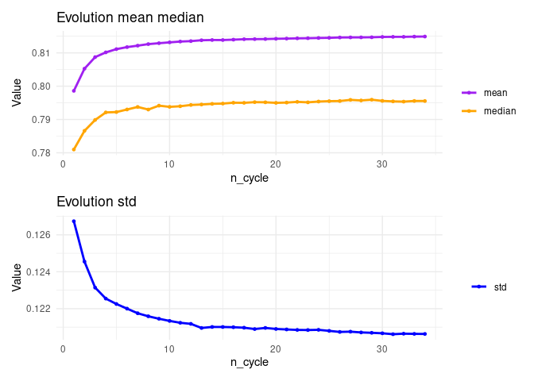

CDB_cycles_AnalysisOfParameters
================

In this notebook, we are studying the different parameters of our method
Complexity Driven Bagging so as to offer a range of selection to the
final user. In particular, we have three parameters:

-   Split: the number of splits in which we cut the complexity spectrum.
    s=1 implies we are training with one easy sample, one uniform sample
    and one hard sample. That is, the cycle length is 3. s=2 implies 6
    samples of different complexity (cycle length is 6).

-   Alpha: to give more weight to the easiest and the hardest instances
    in the bootstrap sampling procedure with the aim of training the
    classifier with samples of higher or lower complexity (thus,
    enlarging the original range of complexity).

-   Number of cycles. How many times the procedure is repeated. This is
    totally related with the final number of ensembles.

Besides these 3 parameters, we have obtained results for different
complexity measures. For the analysis of the parameters, we have
aggregated results over the different complexity measures.

First, we are studying, for each one of the parameters (alpha, split,
number of cycles) independently, for which values there are no
significant differences and, thus, can be eliminated from the range of
recommended values.

In particular:

-   For alpha and split, we aggregate over the rest of parameters since
    the number of tested models depends on the value of split.
    Therefore, for low split values, there are a lot of results but for
    high split values there are just a few (1000 vs 50). This requires
    special statistical test because the design is imbalanced.
    Furthermore, the comparison will not be fair since the number of
    models is indeed the same (we have used around 300 models in all
    cases) but when split is low, the number of cycles is higher and
    more results are saved (for example 1000) and when split is high
    there are only a few cycles (for example 50) but representing the
    same amount of models. Thus, to make the comparison fair (and not
    play with different samples sizes and variances), we aggregate over
    the rest of the results.

-   For the number of cycles, we compared the number of cycles for every
    combination of split and alpha. The idea is that, given a value of
    split and a value of alpha, we want to know when the best accuracy
    is obtained, when there are significant differences, etc. so as to
    recommend the lower number of cycles (lower number of ensembles)
    with the best performance. We start by identifying, for each
    combination of split and alpha, from what number of cycles onwards
    there is no significant difference in the accuracy obtained.

After this analysis, we will have a first range recommendation for every
parameter. Notice that, in all cases, we take into account the mean,
median and standard deviation of the accuracy.

# Parameter analysis

### Mean, median and standard deviation of accuracy for all levels of split

``` r
table_split <- datos %>%
  group_by(split) %>%
  summarise_at(vars(accuracy_mean_mean),  list(mean = mean, median = median, std = sd))
knitr::kable(table_split)
```

| split |      mean |    median |       std |
|------:|----------:|----------:|----------:|
|     1 | 0.8110460 | 0.7967871 | 0.1212139 |
|     2 | 0.8125088 | 0.7959839 | 0.1212647 |
|     4 | 0.8129489 | 0.7946452 | 0.1213289 |
|     6 | 0.8131103 | 0.7943984 | 0.1213001 |
|     8 | 0.8133743 | 0.7939779 | 0.1211680 |
|    10 | 0.8134900 | 0.7944709 | 0.1211299 |
|    12 | 0.8135405 | 0.7943101 | 0.1210803 |
|    14 | 0.8136284 | 0.7938616 | 0.1211058 |
|    16 | 0.8137780 | 0.7937970 | 0.1209858 |
|    18 | 0.8137304 | 0.7939759 | 0.1210338 |
|    20 | 0.8138354 | 0.7942397 | 0.1210338 |
|    22 | 0.8136747 | 0.7941315 | 0.1210665 |
|    24 | 0.8139666 | 0.7938021 | 0.1209256 |
|    26 | 0.8138905 | 0.7943179 | 0.1210517 |
|    28 | 0.8140333 | 0.7946578 | 0.1208977 |
|    30 | 0.8140107 | 0.7944929 | 0.1209749 |


The higher the value of split, the higher the mean (with some
exceptions) of accuracy, the lower the median and the lower the standard
deviation. ¿Medium-low split values?

If we compare if there are significant differences among the different
split values (once aggregated per n_cycle). We obtain that:

For the **mean of the accuracy**, there are no significant differences
among:

-   4 with 6, 6 with 8 and 12

-   8 with 12,14,16

-   10 with 12, 14, 18, 22

-   12 with 14, 16, 18, 20, 22

-   14 with 16, 18, 20, 22, 26

-   From 16 to 30, almost all comparisons are not significantly
    different –\> maximum value of split should be 16

For the **median of the accuracy**, there are no significant differences
among:

-   4 with 6 and 10

-   6 with 8, 10, 12

-   8 with 10, 12, 14, 16, 18, 20, 22

-   10 with 12, 14, 16, 18, 20, 22

-   12 with 14, 16, 18, 20, 22

-   14 with 16, 18, 20, 22, 26

-   From 16 to 30, almost all comparisons are not significantly
    different –\> maximum value of split should be 16

For the **std of the accuracy**, there are no significant differences
among:

-   4 with 6 and 8

-   6 with 8, 10, 12

-   8 with 10, 12, 14, 16, 20

-   10 with 12, 14, 16, 20, 22, 30

-   12 with 14, 16, 20, 22, 26, 30

-   From 14 to 30, almost all comparisons are not significantly
    different –\> maximum value of split should be 14

### Mean, median and standard deviation of accuracy for all levels of alpha

``` r
table_alpha <- datos %>%
  group_by(alpha) %>%
  summarise_at(vars(accuracy_mean_mean),  list(mean = mean, median = median, std = sd))
knitr::kable(table_alpha)
```

| alpha |      mean |    median |       std |
|------:|----------:|----------:|----------:|
|     2 | 0.8129428 | 0.7957598 | 0.1211778 |
|     4 | 0.8129658 | 0.7958410 | 0.1212035 |
|     6 | 0.8128979 | 0.7959097 | 0.1210609 |
|     8 | 0.8127810 | 0.7955892 | 0.1210810 |
|    10 | 0.8126166 | 0.7957162 | 0.1210488 |
|    12 | 0.8123364 | 0.7958433 | 0.1212849 |
|    14 | 0.8123072 | 0.7956720 | 0.1213272 |
|    16 | 0.8121494 | 0.7951638 | 0.1213054 |
|    18 | 0.8123956 | 0.7953308 | 0.1211186 |
|    20 | 0.8121692 | 0.7953601 | 0.1213016 |


The higher the value of alpha, the lower the mean and the median of
accuracy. The standard deviation keeps lower for low-medium values. –\>
Low-medium values of alpha. Lower than 12.

If we compare if there are significant differences among the different
alpha values (once aggregated per n_cycle). We obtain that:

For the **mean of the accuracy**, there are ONLY significant differences
among:

-   2 with 10

-   10 with 12, 14, 16, 18, 20

For the **median of the accuracy**, there are ONLY significant
differences among:

-   2 with 4, 6, 8, 10, 14

-   10 with 12, 16, 20

For the **std of the accuracy**, there are NO significant differences
among:

-   4 with 6 and 8

-   6 with 8, 10, 12

-   8 with 10, 12

-   From 10 to 20, almost all comparisons are not significantly
    different –\> maximum value of alpha should be 10

### Mean, median and standard deviation of accuracy for all levels of n_cycles (for some split values)

We cannot perform a summary of ‘n_cycle’ in general because the number
of cycles depends on the value of split. Thus, we show some cases.

**split = 1**

``` r
table_split1 <- datos %>% filter(split == 1) %>%
  group_by(n_cycle) %>%
  summarise_at(vars(accuracy_mean_mean),  list(mean = mean, median = median, std = sd))
#knitr::kable(table_split1)

#datatable(table_split1)
library(DT)

# Crear una tabla interactiva con paginación
datatable(table_split1, 
          options = list(pageLength = 15, # Muestra 15 filas por página
                         lengthMenu = c(15, 30, 50, 100), # Opciones de filas por página
                         autoWidth = TRUE))
```

<div id="htmlwidget-1aceb931b520ffc81634" style="width:100%;height:auto;" class="datatables html-widget"></div>
<script type="application/json" data-for="htmlwidget-1aceb931b520ffc81634">{"x":{"filter":"none","data":[["1","2","3","4","5","6","7","8","9","10","11","12","13","14","15","16","17","18","19","20","21","22","23","24","25","26","27","28","29","30","31","32","33","34","35","36","37","38","39","40","41","42","43","44","45","46","47","48","49","50","51","52","53","54","55","56","57","58","59","60","61","62","63","64","65","66","67","68","69","70","71","72","73","74","75","76","77","78","79","80","81","82","83","84","85","86","87","88","89","90","91","92","93","94","95","96","97","98","99","100"],["1","2","3","4","5","6","7","8","9","10","11","12","13","14","15","16","17","18","19","20","21","22","23","24","25","26","27","28","29","30","31","32","33","34","35","36","37","38","39","40","41","42","43","44","45","46","47","48","49","50","51","52","53","54","55","56","57","58","59","60","61","62","63","64","65","66","67","68","69","70","71","72","73","74","75","76","77","78","79","80","81","82","83","84","85","86","87","88","89","90","91","92","93","94","95","96","97","98","99","100"],[0.7756789799370615,0.7859495855833291,0.7970599688807822,0.7994771346077297,0.8029400141329068,0.8037183011218635,0.8059178111924425,0.8065337472182833,0.807532015722274,0.8078525905148128,0.80852713436644,0.8087428661624629,0.809226679059737,0.809384522779915,0.8097374284627339,0.8099222640500335,0.8102506890644106,0.8105222887814481,0.8106788180924572,0.810757056071681,0.8109621545675415,0.8109907945948786,0.8112207597822079,0.8113277015218633,0.8114490007359777,0.8115015773202062,0.8116709716268965,0.8116816391742367,0.8118198169966774,0.8118466234590633,0.8119324625961842,0.8120285383565764,0.8120468762298103,0.812072715276619,0.8121428316368022,0.812244226409767,0.8122954556244697,0.8123181504686161,0.8123704509482552,0.8123625795282199,0.8123521163230872,0.8124012331639319,0.8124386387884246,0.812491707807562,0.8126015300671995,0.8125786510457091,0.8126099161434401,0.812641243271975,0.8126142472667296,0.812649648217402,0.8126935936032713,0.812689720349454,0.8127479623244342,0.8127801013818506,0.8128307042424455,0.8129148062642038,0.8129611419741725,0.8129984445808802,0.8129814228851399,0.8129268440434924,0.8129403328205114,0.8129809279814422,0.8129665153776841,0.8129417013233272,0.8129671200759073,0.812991284945376,0.8129389525323989,0.8129920076870893,0.8129712377862766,0.8130037697825233,0.8129974026331648,0.813034410213808,0.8130781478377378,0.8130690903521323,0.8131016800590133,0.8130674285282763,0.8130863084494696,0.8131161418162117,0.8130629267536752,0.813062556719282,0.8131000541696333,0.8131418825570792,0.8131550024669012,0.8131062711046775,0.8131826122735167,0.8131811127163336,0.8131718362375481,0.8131923119804078,0.8132136070312054,0.8132081116940288,0.8131905422033443,0.8131367715882513,0.8132379044440508,0.8131966053752163,0.8132150403614429,0.8132221441924116,0.8131726965599892,0.8131899257987177,0.8132345184736695,0.8131858752475128],[0.7591390091390096,0.7744528188802995,0.7860915378090949,0.7875738892151105,0.7898607033339859,0.790702741953802,0.7915994649964115,0.7929174006654924,0.7934321785085146,0.7934657793436419,0.7943898270234144,0.794122234062862,0.7945299145299145,0.7946952342546936,0.7951246166895021,0.7949990213348994,0.7952206543809595,0.7958552746904626,0.7953370595100875,0.7950384941606314,0.7958051265900985,0.79618287988517,0.7960142232661315,0.795981143616852,0.7956135686479195,0.7960229526444,0.7959297318457625,0.796312716121876,0.7964279720973164,0.7961231318864905,0.7966748123236675,0.7968614210217264,0.7969261701336565,0.7968392824308854,0.7971641547595745,0.797074443792001,0.796740066549227,0.7968936658750875,0.797008255386118,0.797050016706505,0.797178859449852,0.797390844241989,0.7970933992498875,0.7976080962024734,0.797299719097853,0.7974742273939059,0.7981018367489949,0.7974160308440175,0.7976273895739545,0.7971791906143055,0.7973646300832911,0.7972023226985054,0.797221043107643,0.7973760901241815,0.7970356234096695,0.7974203596171365,0.797456123181314,0.7975190938549714,0.797342477206769,0.7970888643633055,0.7973983682435815,0.7975004893325505,0.7972463626280419,0.797433663311526,0.7976247798003525,0.7976016477161515,0.7976988674997505,0.797605822694881,0.7978455131065569,0.7980463163194085,0.7982311271456405,0.7980668942310165,0.7981643573343705,0.797945665524122,0.7983263686965515,0.798083249800807,0.7981274624289429,0.798062484746115,0.7979155421903514,0.797996825764001,0.798165818490246,0.7982562952867835,0.7978702418587915,0.797933180129957,0.798480531813865,0.798316483488239,0.798717662673486,0.7983681250741861,0.7983247375880504,0.79848514724681,0.7982223629298955,0.7983780325480461,0.797934586677344,0.797937053051557,0.798520101297879,0.798491756256811,0.798235239456613,0.798294008790192,0.7982095124270695,0.7980676680464636],[0.1335891538545806,0.1303083558883141,0.1266213819433652,0.1258194464205423,0.1245427916531152,0.1243517662234043,0.1233059983876343,0.1230519545246519,0.1226671190824451,0.1225563119652996,0.1222828297989808,0.1223140618851613,0.1220798684652157,0.122049413712398,0.1218240069504547,0.1218300374196896,0.1216322579557931,0.1214595798036654,0.1214272372335103,0.1213841537396757,0.1212865070502785,0.1212791096170253,0.1212699054229705,0.1211238170625833,0.1211407993742443,0.1211390937252772,0.1209755857970338,0.1210195031975689,0.1209704224511375,0.1209070977761705,0.1209118890906943,0.1208236190230184,0.1208330551504891,0.1208331091723611,0.1207984182085779,0.1207836258240388,0.1206765100582315,0.1206443266771459,0.1205936796674452,0.1206606961091248,0.120678604924233,0.1207203111067484,0.1206390427167209,0.1206672377180561,0.1205903687443907,0.1206267313495786,0.1206047134016691,0.1205582385117396,0.1206082443956942,0.1205949469477426,0.1206044464593108,0.1206167696486411,0.1205666747391105,0.1205324113664994,0.1205376491666159,0.1204809033687989,0.1204806671002468,0.1204710472761741,0.1204627952598615,0.1204368663048176,0.1204498614352836,0.1204286778121066,0.1204683175039841,0.1205009404395617,0.1204499003670762,0.120448433617594,0.1204724953536595,0.1204102278466753,0.1205171236516227,0.1204602504556382,0.1204689861312741,0.1204247921175566,0.1204234763845321,0.1204333806119962,0.1204168515237955,0.1204307508975576,0.120444275170101,0.1203964882551632,0.1204395990239672,0.1203841855173337,0.1203662639865683,0.1203452853404678,0.120328194181985,0.1203814335902497,0.1203830136109503,0.1204275097806398,0.1204139391740355,0.1203962249928562,0.1203776552918961,0.1203829768640195,0.1203959896075871,0.1203971502072732,0.1203632388619367,0.1203721637186079,0.1203570299956957,0.120369161290458,0.1203869312423478,0.120366301635384,0.1203836187922254,0.1203858802778909]],"container":"<table class=\"display\">\n  <thead>\n    <tr>\n      <th> <\/th>\n      <th>n_cycle<\/th>\n      <th>mean<\/th>\n      <th>median<\/th>\n      <th>std<\/th>\n    <\/tr>\n  <\/thead>\n<\/table>","options":{"pageLength":15,"lengthMenu":[15,30,50,100],"autoWidth":true,"columnDefs":[{"className":"dt-right","targets":[2,3,4]},{"orderable":false,"targets":0}],"order":[],"orderClasses":false}},"evals":[],"jsHooks":[]}</script>


The higher the number of cycles, the higher the mean, median of accuracy
and the lower the standard deviation. For high values of cycles, the
accuracy clearly stabilizes and there is no always a clear increase over
time. For example, results with 89 cycles are better than with 100.

**split = 2**

``` r
table_split2 <- datos %>% filter(split == 2) %>%
  group_by(n_cycle) %>%
  summarise_at(vars(accuracy_mean_mean),  list(mean = mean, median = median, std = sd))
knitr::kable(table_split2)
```

| n_cycle |      mean |    median |       std |
|:--------|----------:|----------:|----------:|
| 1       | 0.7878423 | 0.7756056 | 0.1302345 |
| 2       | 0.7978929 | 0.7832387 | 0.1268106 |
| 3       | 0.8042211 | 0.7884107 | 0.1244836 |
| 4       | 0.8062211 | 0.7895648 | 0.1237105 |
| 5       | 0.8082450 | 0.7907575 | 0.1228781 |
| 6       | 0.8090127 | 0.7913615 | 0.1227202 |
| 7       | 0.8099046 | 0.7923985 | 0.1223956 |
| 8       | 0.8106248 | 0.7931522 | 0.1220386 |
| 9       | 0.8109993 | 0.7932107 | 0.1219353 |
| 10      | 0.8113641 | 0.7935095 | 0.1217677 |
| 11      | 0.8117868 | 0.7939090 | 0.1215668 |
| 12      | 0.8118698 | 0.7943144 | 0.1215419 |
| 13      | 0.8121306 | 0.7944254 | 0.1214045 |
| 14      | 0.8123525 | 0.7948739 | 0.1213392 |
| 15      | 0.8126514 | 0.7951106 | 0.1212693 |
| 16      | 0.8126805 | 0.7951063 | 0.1212591 |
| 17      | 0.8128990 | 0.7955438 | 0.1212589 |
| 18      | 0.8130042 | 0.7956286 | 0.1212281 |
| 19      | 0.8131348 | 0.7956102 | 0.1212161 |
| 20      | 0.8131206 | 0.7961042 | 0.1211763 |
| 21      | 0.8134105 | 0.7959170 | 0.1209994 |
| 22      | 0.8133977 | 0.7958501 | 0.1210053 |
| 23      | 0.8135931 | 0.7961845 | 0.1208718 |
| 24      | 0.8136424 | 0.7961932 | 0.1208730 |
| 25      | 0.8137241 | 0.7960968 | 0.1207911 |
| 26      | 0.8137442 | 0.7965650 | 0.1207932 |
| 27      | 0.8138485 | 0.7960773 | 0.1207203 |
| 28      | 0.8138378 | 0.7967582 | 0.1207137 |
| 29      | 0.8138301 | 0.7968033 | 0.1207834 |
| 30      | 0.8138605 | 0.7967202 | 0.1207607 |
| 31      | 0.8139992 | 0.7967785 | 0.1207395 |
| 32      | 0.8140961 | 0.7973302 | 0.1206660 |
| 33      | 0.8140979 | 0.7971923 | 0.1206819 |
| 34      | 0.8141011 | 0.7966902 | 0.1206659 |
| 35      | 0.8141745 | 0.7969440 | 0.1206125 |
| 36      | 0.8142054 | 0.7966909 | 0.1206157 |
| 37      | 0.8142043 | 0.7964537 | 0.1206885 |
| 38      | 0.8142868 | 0.7967746 | 0.1206271 |
| 39      | 0.8143627 | 0.7965885 | 0.1205761 |
| 40      | 0.8143561 | 0.7967773 | 0.1205673 |
| 41      | 0.8143234 | 0.7965640 | 0.1205901 |
| 42      | 0.8143553 | 0.7965451 | 0.1205912 |
| 43      | 0.8143429 | 0.7965205 | 0.1205719 |
| 44      | 0.8143546 | 0.7967322 | 0.1205887 |
| 45      | 0.8143827 | 0.7968197 | 0.1205847 |
| 46      | 0.8144383 | 0.7971508 | 0.1205513 |
| 47      | 0.8144575 | 0.7969159 | 0.1205463 |
| 48      | 0.8144753 | 0.7973029 | 0.1205636 |
| 49      | 0.8145061 | 0.7972868 | 0.1205463 |
| 50      | 0.8145415 | 0.7973226 | 0.1205443 |
| 51      | 0.8145303 | 0.7973289 | 0.1205242 |
| 52      | 0.8145728 | 0.7972118 | 0.1205605 |
| 53      | 0.8145070 | 0.7970549 | 0.1205820 |
| 54      | 0.8145590 | 0.7973896 | 0.1205244 |
| 55      | 0.8145553 | 0.7971276 | 0.1205232 |
| 56      | 0.8145220 | 0.7969456 | 0.1206034 |
| 57      | 0.8145558 | 0.7968712 | 0.1205985 |
| 58      | 0.8145750 | 0.7969573 | 0.1205827 |
| 59      | 0.8146399 | 0.7969873 | 0.1205830 |
| 60      | 0.8146042 | 0.7972197 | 0.1206055 |


The higher the number of cycles, the higher the mean, median of accuracy
and the lower the standard deviation. For high values of cycles, the
accuracy clearly stabilizes and there is no always a clear increase over
time.

**split = 4**

``` r
table_split4 <- datos %>% filter(split == 4) %>%
  group_by(n_cycle) %>%
  summarise_at(vars(accuracy_mean_mean),  list(mean = mean, median = median, std = sd))
knitr::kable(table_split4)
```

| n_cycle |      mean |    median |       std |
|:--------|----------:|----------:|----------:|
| 1       | 0.7985992 | 0.7809906 | 0.1267342 |
| 2       | 0.8052539 | 0.7865956 | 0.1245487 |
| 3       | 0.8087263 | 0.7898662 | 0.1231415 |
| 4       | 0.8101471 | 0.7921213 | 0.1225476 |
| 5       | 0.8111221 | 0.7922317 | 0.1222535 |
| 6       | 0.8117260 | 0.7930016 | 0.1220022 |
| 7       | 0.8121662 | 0.7937643 | 0.1217520 |
| 8       | 0.8126286 | 0.7929885 | 0.1215884 |
| 9       | 0.8129014 | 0.7941532 | 0.1214551 |
| 10      | 0.8131537 | 0.7937974 | 0.1213373 |
| 11      | 0.8133987 | 0.7939763 | 0.1212369 |
| 12      | 0.8135283 | 0.7943581 | 0.1211784 |
| 13      | 0.8137883 | 0.7944978 | 0.1209563 |
| 14      | 0.8138608 | 0.7946963 | 0.1210106 |
| 15      | 0.8138553 | 0.7947821 | 0.1210093 |
| 16      | 0.8139686 | 0.7950329 | 0.1209964 |
| 17      | 0.8141007 | 0.7950047 | 0.1209703 |
| 18      | 0.8141282 | 0.7952039 | 0.1208968 |
| 19      | 0.8141507 | 0.7951631 | 0.1209582 |
| 20      | 0.8142332 | 0.7949935 | 0.1209015 |
| 21      | 0.8142853 | 0.7950799 | 0.1208754 |
| 22      | 0.8143584 | 0.7952926 | 0.1208503 |
| 23      | 0.8144006 | 0.7951492 | 0.1208439 |
| 24      | 0.8144707 | 0.7953898 | 0.1208550 |
| 25      | 0.8145182 | 0.7955021 | 0.1207992 |
| 26      | 0.8146189 | 0.7955435 | 0.1207415 |
| 27      | 0.8146431 | 0.7958857 | 0.1207559 |
| 28      | 0.8146555 | 0.7957141 | 0.1207142 |
| 29      | 0.8146843 | 0.7959362 | 0.1206945 |
| 30      | 0.8147846 | 0.7955836 | 0.1206679 |
| 31      | 0.8148139 | 0.7954345 | 0.1206182 |
| 32      | 0.8148141 | 0.7953640 | 0.1206461 |
| 33      | 0.8148755 | 0.7955594 | 0.1206363 |
| 34      | 0.8149022 | 0.7955458 | 0.1206320 |



The higher the number of cycles, the higher the mean, median of accuracy
and the lower the standard deviation. For high values of cycles, the
accuracy stabilizes but keeps showing an increasing trend. The longest
the cycle, the less stable the trend (still increasing).

**split = 10**

``` r
table_split10 <- datos %>% filter(split == 10) %>%
  group_by(n_cycle) %>%
  summarise_at(vars(accuracy_mean_mean),  list(mean = mean, median = median, std = sd))
knitr::kable(table_split10)
```

| n_cycle |      mean |    median |       std |
|:--------|----------:|----------:|----------:|
| 1       | 0.8071858 | 0.7880451 | 0.1237565 |
| 2       | 0.8108445 | 0.7918125 | 0.1223758 |
| 3       | 0.8124787 | 0.7937626 | 0.1217319 |
| 4       | 0.8132270 | 0.7943083 | 0.1214067 |
| 5       | 0.8136229 | 0.7948287 | 0.1211650 |
| 6       | 0.8138476 | 0.7946337 | 0.1210393 |
| 7       | 0.8141833 | 0.7949090 | 0.1208817 |
| 8       | 0.8142894 | 0.7959271 | 0.1209074 |
| 9       | 0.8144666 | 0.7951143 | 0.1208267 |
| 10      | 0.8145978 | 0.7958262 | 0.1207563 |
| 11      | 0.8146281 | 0.7947367 | 0.1207611 |
| 12      | 0.8146653 | 0.7944111 | 0.1207817 |
| 13      | 0.8147261 | 0.7949773 | 0.1206724 |
| 14      | 0.8147200 | 0.7950719 | 0.1207383 |
| 15      | 0.8148667 | 0.7955196 | 0.1206696 |


The higher the number of cycles, the higher the mean, median of accuracy
and the lower the standard deviation. For high values of cycles, the
accuracy stabilizes but keeps showing an increasing trend. The longest
the cycle, the less stable the trend (still increasing).

# Number of cycles

``` r
# Tenemos que hacer el análisis para cada combo_alpha_split
valores_combo = levels(datos$combo_alpha_split)
n_combo = length(valores_combo)
combo_friedman = data.frame(valores_combo)
combo_friedman$p_value = rep(NA,n_combo)

for (i in valores_combo){
  #print(i)
  datos_i = datos[datos$combo_alpha_split==i,]
  fri = friedman.test(accuracy_mean_mean ~ n_cycle |Dataset, data=as.matrix(datos_i))
  combo_friedman[combo_friedman$valores_combo==i,2] = fri$p.value
}
combo_friedman[combo_friedman$p_value> 0.05]
```

    data frame with 0 columns and 160 rows

``` r
# es decir, en todos los casos hay diferencias significativas
```

Once we have checked that there are significant differences between at
least one value in the combo, we make multiple comparisons to analyze
when adding another cycle is not worthy since the increase is not
significant.

``` r
dif_no_sig <- data.frame(valores_combo)
dif_no_sig$niveles = rep(NA,n_combo)

# Lo dejamos en comentarios porque tarda mucho

# for (i in valores_combo){
#   print(i)
#   datos_i = datos[datos$combo_alpha_split==i,]
#   datos_i$n_cycle <- factor(datos_i$n_cycle) # los niveles del factor cambian en cada subset
#   pwc2 <- datos_i %>% 
#     wilcox_test(accuracy_mean_mean ~ n_cycle, paired = TRUE, p.adjust.method = "bonferroni")
#   # Filtrar comparaciones con diferencias no significativas (suponiendo un umbral de p > 0.05)
#   no_significativas <- pwc2[pwc2$p.adj>0.1,]
# 
#   
#   # si no todas las comparaciones con ese nivel son no significativas, lo quitamos 
#   # es decir, no nos vale que solo no haya diferencia entre 3 y 5 y con el resto (3-6,3-7,etc) sí
#   max_cycles = max(as.numeric(pwc2$group2))
#   valores_check <- unique(as.numeric(no_significativas$group1))
#   for (v in valores_check){
#     if (sum(no_significativas$group1 == v) <(max_cycles - v) ){
#       no_significativas = no_significativas[no_significativas$group1!=v,]
#     }
#   }
#   
#   # Extraer los niveles de los pares con diferencias no significativas
#   niveles_no_significativos <- unique(c(no_significativas$group1, no_significativas$group2))
# 
#   dif_no_sig[dif_no_sig$valores_combo==i,2] = paste(niveles_no_significativos, collapse = ", ")
# }

#write.csv(dif_no_sig, "CDB_cycles_ParametersComboAlphaSplit_dif_no_signif_cycles_mean.csv")
```

In this dataframe we have, for every combination of alpha and split, the
number of cycles with no significant difference between all of them.

``` r
dif_no_sig_mean <- read.csv('CDB_cycles_ParametersComboAlphaSplit_dif_no_signif_cycles_mean.csv') 
head(dif_no_sig_mean)
```

      X   valores_combo
    1 1  alpha10-split1
    2 2 alpha10-split10
    3 3 alpha10-split12
    4 4 alpha10-split14
    5 5 alpha10-split16
    6 6 alpha10-split18
                                                                                                                                                                                                                                                                                                                                          niveles
    1 18, 21, 22, 23, 24, 25, 26, 27, 28, 29, 30, 31, 32, 33, 34, 35, 36, 37, 38, 39, 40, 41, 42, 43, 44, 45, 46, 47, 48, 49, 50, 51, 52, 53, 54, 55, 56, 57, 58, 59, 60, 61, 62, 63, 64, 65, 66, 67, 68, 69, 70, 71, 72, 73, 74, 75, 76, 77, 78, 79, 80, 81, 82, 83, 84, 85, 86, 87, 88, 89, 90, 91, 92, 93, 94, 95, 96, 97, 98, 99, 19, 20, 100
    2                                                                                                                                                                                                                                                                                                       5, 6, 7, 8, 9, 10, 11, 12, 13, 14, 15
    3                                                                                                                                                                                                                                                                                                                   5, 6, 7, 8, 9, 10, 11, 12
    4                                                                                                                                                                                                                                                                                                                 3, 4, 5, 6, 7, 8, 9, 10, 11
    5                                                                                                                                                                                                                                                                                                                        4, 5, 6, 7, 8, 9, 10
    6                                                                                                                                                                                                                                                                                                                               5, 6, 7, 8, 9

Let’s relate that with the number of models to have a first view of
where to stop adding models. We create two different columns:

-   num_models: it relates the first (minimum) number of cycles that
    presents no significant differences with all its consecutive number
    of cycles with the number of models it implies.

-   num_models2: it is exactly the same concept as num_models but with
    the second value of number of cycles in case we want to be more
    conservative

``` r
# Variables to character
dif_no_sig_mean$niveles <- as.character(dif_no_sig_mean$niveles)
dif_no_sig_mean$valores_combo <- as.character(dif_no_sig_mean$valores_combo)

# Order the values 
dif_no_sig_mean$niveles <- sapply(strsplit(dif_no_sig_mean$niveles, ", "), function(x) {
  paste(sort(as.numeric(x)), collapse = ", ")
})

# Extraer el valor numérico después de "split" en la columna B
dif_no_sig_mean$valor_split <- as.numeric(gsub(".*split", "", dif_no_sig_mean$valores_combo))

# New columns with number of models
dif_no_sig_mean$num_models <- mapply(function(a, b) {
  min(as.numeric(strsplit(a, ", ")[[1]])) * (2*b +1)
}, dif_no_sig_mean$niveles, dif_no_sig_mean$valor_split)

# New columns with number of models (for the second value)
dif_no_sig_mean$num_models2 <- mapply(function(a, b) {
  valores <- sort(as.numeric(strsplit(a, ", ")[[1]])) 
  segundo_min <- ifelse(length(valores) > 1, valores[2], valores[1])  # Obtener el segundo mínimo o el primero si hay solo uno
  segundo_min * (2*b +1)
}, dif_no_sig_mean$niveles, dif_no_sig_mean$valor_split)

head(dif_no_sig_mean)
```

      X   valores_combo
    1 1  alpha10-split1
    2 2 alpha10-split10
    3 3 alpha10-split12
    4 4 alpha10-split14
    5 5 alpha10-split16
    6 6 alpha10-split18
                                                                                                                                                                                                                                                                                                                                          niveles
    1 18, 19, 20, 21, 22, 23, 24, 25, 26, 27, 28, 29, 30, 31, 32, 33, 34, 35, 36, 37, 38, 39, 40, 41, 42, 43, 44, 45, 46, 47, 48, 49, 50, 51, 52, 53, 54, 55, 56, 57, 58, 59, 60, 61, 62, 63, 64, 65, 66, 67, 68, 69, 70, 71, 72, 73, 74, 75, 76, 77, 78, 79, 80, 81, 82, 83, 84, 85, 86, 87, 88, 89, 90, 91, 92, 93, 94, 95, 96, 97, 98, 99, 100
    2                                                                                                                                                                                                                                                                                                       5, 6, 7, 8, 9, 10, 11, 12, 13, 14, 15
    3                                                                                                                                                                                                                                                                                                                   5, 6, 7, 8, 9, 10, 11, 12
    4                                                                                                                                                                                                                                                                                                                 3, 4, 5, 6, 7, 8, 9, 10, 11
    5                                                                                                                                                                                                                                                                                                                        4, 5, 6, 7, 8, 9, 10
    6                                                                                                                                                                                                                                                                                                                               5, 6, 7, 8, 9
      valor_split num_models num_models2
    1           1         54          57
    2          10        105         126
    3          12        125         150
    4          14         87         116
    5          16        132         165
    6          18        185         222

We perform the same analysis for the median and the standard deviation.

For the **median**:

``` r
# dif_no_sig_mean$niveles_mediana = rep(NA,n_combo)
# 
# # Lo dejamos en comentarios porque tarda mucho
# 
# for (i in valores_combo){
#   print(i)
#   datos_i = datos[datos$combo_alpha_split==i,]
#   datos_i$n_cycle <- factor(datos_i$n_cycle) # los niveles del factor cambian en cada subset
#   pwc2 <- datos_i %>%
#     wilcox_test(accuracy_mean_median ~ n_cycle, paired = TRUE, p.adjust.method = "bonferroni")
#   # Filtrar comparaciones con diferencias no significativas (suponiendo un umbral de p > 0.05)
#   no_significativas <- pwc2[pwc2$p.adj>0.1,]
# 
# 
#   # si no todas las comparaciones con ese nivel son no significativas, lo quitamos
#   # es decir, no nos vale que solo no haya diferencia entre 3 y 5 y con el resto (3-6,3-7,etc) sí
#   max_cycles = max(as.numeric(pwc2$group2))
#   valores_check <- unique(as.numeric(no_significativas$group1))
#   for (v in valores_check){
#     if (sum(no_significativas$group1 == v) <(max_cycles - v) ){
#       no_significativas = no_significativas[no_significativas$group1!=v,]
#     }
#   }
# 
#   # Extraer los niveles de los pares con diferencias no significativas
#   niveles_no_significativos <- unique(c(no_significativas$group1, no_significativas$group2))
# 
#   dif_no_sig_mean[dif_no_sig_mean$valores_combo==i,'niveles_mediana'] = paste(niveles_no_significativos, collapse = ", ")
# }

#write.csv(dif_no_sig_mean, "CDB_cycles_ParametersComboAlphaSplit_dif_no_signif_cycles_mean_median.csv")
```

For the **standard deviation**:

``` r
# dif_no_sig_mean$niveles_std = rep(NA,n_combo)
# 
# # Lo dejamos en comentarios porque tarda mucho
# 
# for (i in valores_combo){
#   print(i)
#   datos_i = datos[datos$combo_alpha_split==i,]
#   datos_i$n_cycle <- factor(datos_i$n_cycle) # los niveles del factor cambian en cada subset
#   pwc2 <- datos_i %>%
#     wilcox_test(accuracy_mean_std ~ n_cycle, paired = TRUE, p.adjust.method = "bonferroni")
#   # Filtrar comparaciones con diferencias no significativas (suponiendo un umbral de p > 0.05)
#   no_significativas <- pwc2[pwc2$p.adj>0.1,]
# 
# 
#   # si no todas las comparaciones con ese nivel son no significativas, lo quitamos
#   # es decir, no nos vale que solo no haya diferencia entre 3 y 5 y con el resto (3-6,3-7,etc) sí
#   max_cycles = max(as.numeric(pwc2$group2))
#   valores_check <- unique(as.numeric(no_significativas$group1))
#   for (v in valores_check){
#     if (sum(no_significativas$group1 == v) <(max_cycles - v) ){
#       no_significativas = no_significativas[no_significativas$group1!=v,]
#     }
#   }
# 
#   # Extraer los niveles de los pares con diferencias no significativas
#   niveles_no_significativos <- unique(c(no_significativas$group1, no_significativas$group2))
# 
#   dif_no_sig_mean[dif_no_sig_mean$valores_combo==i,'niveles_std'] = paste(niveles_no_significativos, collapse = ", ")
# }

#write.csv(dif_no_sig_mean, "CDB_cycles_ParametersComboAlphaSplit_dif_no_signif_cycles_mean_median_std.csv")
```

Now we relate the number of cycles with the number of ensembles for all
statistical measures (mean, median, std):

``` r
dif_no_sig_all <- read.csv('CDB_cycles_ParametersComboAlphaSplit_dif_no_signif_cycles_mean_median_std.csv') 
head(dif_no_sig_all)
```

      X.1 X   valores_combo
    1   1 1  alpha10-split1
    2   2 2 alpha10-split10
    3   3 3 alpha10-split12
    4   4 4 alpha10-split14
    5   5 5 alpha10-split16
    6   6 6 alpha10-split18
                                                                                                                                                                                                                                                                                                                                          niveles
    1 18, 19, 20, 21, 22, 23, 24, 25, 26, 27, 28, 29, 30, 31, 32, 33, 34, 35, 36, 37, 38, 39, 40, 41, 42, 43, 44, 45, 46, 47, 48, 49, 50, 51, 52, 53, 54, 55, 56, 57, 58, 59, 60, 61, 62, 63, 64, 65, 66, 67, 68, 69, 70, 71, 72, 73, 74, 75, 76, 77, 78, 79, 80, 81, 82, 83, 84, 85, 86, 87, 88, 89, 90, 91, 92, 93, 94, 95, 96, 97, 98, 99, 100
    2                                                                                                                                                                                                                                                                                                       5, 6, 7, 8, 9, 10, 11, 12, 13, 14, 15
    3                                                                                                                                                                                                                                                                                                                   5, 6, 7, 8, 9, 10, 11, 12
    4                                                                                                                                                                                                                                                                                                                 3, 4, 5, 6, 7, 8, 9, 10, 11
    5                                                                                                                                                                                                                                                                                                                        4, 5, 6, 7, 8, 9, 10
    6                                                                                                                                                                                                                                                                                                                               5, 6, 7, 8, 9
      valor_split num_models num_models2
    1           1         54          57
    2          10        105         126
    3          12        125         150
    4          14         87         116
    5          16        132         165
    6          18        185         222
                                                                                                                                                                                                                                                                                                                              niveles_mediana
    1 19, 20, 21, 22, 23, 24, 25, 26, 27, 28, 29, 30, 31, 32, 33, 34, 35, 36, 37, 38, 39, 40, 41, 42, 43, 44, 45, 46, 47, 48, 49, 50, 51, 52, 53, 54, 55, 56, 57, 58, 59, 60, 61, 62, 63, 64, 65, 66, 67, 68, 69, 70, 71, 72, 73, 74, 75, 76, 77, 78, 79, 80, 81, 82, 83, 84, 85, 86, 87, 88, 89, 90, 91, 92, 93, 94, 95, 96, 97, 98, 99, 100
    2                                                                                                                                                                                                                                                                                                4, 5, 6, 7, 8, 9, 10, 11, 12, 13, 14, 15
    3                                                                                                                                                                                                                                                                                                         3, 5, 6, 7, 8, 9, 10, 11, 4, 12
    4                                                                                                                                                                                                                                                                                                          2, 3, 4, 5, 6, 7, 8, 9, 10, 11
    5                                                                                                                                                                                                                                                                                                                 3, 4, 5, 6, 7, 8, 9, 10
    6                                                                                                                                                                                                                                                                                                                     3, 4, 5, 6, 7, 8, 9
                                                                                                                                                                                                                                                                                                                                                                               niveles_std
    1 7, 8, 9, 10, 11, 12, 13, 14, 15, 16, 17, 18, 19, 20, 21, 22, 23, 24, 25, 26, 27, 28, 29, 30, 31, 32, 33, 34, 35, 36, 37, 38, 39, 40, 41, 42, 43, 44, 45, 46, 47, 48, 49, 50, 51, 52, 53, 54, 55, 56, 57, 58, 59, 60, 61, 62, 63, 64, 65, 66, 67, 68, 69, 70, 71, 72, 73, 74, 75, 76, 77, 78, 79, 80, 81, 82, 83, 84, 85, 86, 87, 88, 89, 90, 91, 92, 93, 94, 95, 96, 97, 98, 99, 100
    2                                                                                                                                                                                                                                                                                                                                                5, 6, 7, 8, 9, 10, 11, 12, 13, 14, 15
    3                                                                                                                                                                                                                                                                                                                                                            5, 6, 7, 8, 9, 10, 11, 12
    4                                                                                                                                                                                                                                                                                                                                                          3, 4, 5, 6, 7, 8, 9, 10, 11
    5                                                                                                                                                                                                                                                                                                                                                                    5, 6, 7, 8, 9, 10
    6                                                                                                                                                                                                                                                                                                                                                                  3, 4, 5, 6, 7, 8, 9

``` r
# Variables to character
dif_no_sig_all$niveles_mediana <- as.character(dif_no_sig_all$niveles_mediana)
dif_no_sig_all$niveles_std <- as.character(dif_no_sig_all$niveles_std)
dif_no_sig_all$valores_combo <- as.character(dif_no_sig_all$valores_combo)

# Order the values 
dif_no_sig_all$niveles_mediana <- sapply(strsplit(dif_no_sig_all$niveles_mediana, ", "), function(x) {
  paste(sort(as.numeric(x)), collapse = ", ")
})

dif_no_sig_all$niveles_std <- sapply(strsplit(dif_no_sig_all$niveles_std, ", "), function(x) {
  paste(sort(as.numeric(x)), collapse = ", ")
})


# New columns with number of models
dif_no_sig_all$num_models_mediana <- mapply(function(a, b) {
  min(as.numeric(strsplit(a, ", ")[[1]])) * (2*b +1)
}, dif_no_sig_all$niveles_mediana, dif_no_sig_all$valor_split)

dif_no_sig_all$num_models_std <- mapply(function(a, b) {
  min(as.numeric(strsplit(a, ", ")[[1]])) * (2*b +1)
}, dif_no_sig_all$niveles_std, dif_no_sig_all$valor_split)

# New columns with number of models (for the second value)
dif_no_sig_all$num_models2_mediana <- mapply(function(a, b) {
  valores <- sort(as.numeric(strsplit(a, ", ")[[1]])) 
  segundo_min <- ifelse(length(valores) > 1, valores[2], valores[1])  # Obtener el segundo mínimo o el primero si hay solo uno
  segundo_min * (2*b +1)
}, dif_no_sig_all$niveles_mediana, dif_no_sig_all$valor_split)

dif_no_sig_all$num_models2_std <- mapply(function(a, b) {
  valores <- sort(as.numeric(strsplit(a, ", ")[[1]])) 
  segundo_min <- ifelse(length(valores) > 1, valores[2], valores[1])  # Obtener el segundo mínimo o el primero si hay solo uno
  segundo_min * (2*b +1)
}, dif_no_sig_all$niveles_std, dif_no_sig_all$valor_split)

# Sacamos tb el valor en ciclos
dif_no_sig_all$cycles_mean <- sapply(strsplit(dif_no_sig_all$niveles, ", "), function(x) {
  min(as.numeric(x))})

dif_no_sig_all$cycles_median <- sapply(strsplit(dif_no_sig_all$niveles_mediana, ", "), function(x) {
  min(as.numeric(x))})

dif_no_sig_all$cycles_std <- sapply(strsplit(dif_no_sig_all$niveles_std, ", "), function(x) {
  min(as.numeric(x))})


head(dif_no_sig_all)
```

      X.1 X   valores_combo
    1   1 1  alpha10-split1
    2   2 2 alpha10-split10
    3   3 3 alpha10-split12
    4   4 4 alpha10-split14
    5   5 5 alpha10-split16
    6   6 6 alpha10-split18
                                                                                                                                                                                                                                                                                                                                          niveles
    1 18, 19, 20, 21, 22, 23, 24, 25, 26, 27, 28, 29, 30, 31, 32, 33, 34, 35, 36, 37, 38, 39, 40, 41, 42, 43, 44, 45, 46, 47, 48, 49, 50, 51, 52, 53, 54, 55, 56, 57, 58, 59, 60, 61, 62, 63, 64, 65, 66, 67, 68, 69, 70, 71, 72, 73, 74, 75, 76, 77, 78, 79, 80, 81, 82, 83, 84, 85, 86, 87, 88, 89, 90, 91, 92, 93, 94, 95, 96, 97, 98, 99, 100
    2                                                                                                                                                                                                                                                                                                       5, 6, 7, 8, 9, 10, 11, 12, 13, 14, 15
    3                                                                                                                                                                                                                                                                                                                   5, 6, 7, 8, 9, 10, 11, 12
    4                                                                                                                                                                                                                                                                                                                 3, 4, 5, 6, 7, 8, 9, 10, 11
    5                                                                                                                                                                                                                                                                                                                        4, 5, 6, 7, 8, 9, 10
    6                                                                                                                                                                                                                                                                                                                               5, 6, 7, 8, 9
      valor_split num_models num_models2
    1           1         54          57
    2          10        105         126
    3          12        125         150
    4          14         87         116
    5          16        132         165
    6          18        185         222
                                                                                                                                                                                                                                                                                                                              niveles_mediana
    1 19, 20, 21, 22, 23, 24, 25, 26, 27, 28, 29, 30, 31, 32, 33, 34, 35, 36, 37, 38, 39, 40, 41, 42, 43, 44, 45, 46, 47, 48, 49, 50, 51, 52, 53, 54, 55, 56, 57, 58, 59, 60, 61, 62, 63, 64, 65, 66, 67, 68, 69, 70, 71, 72, 73, 74, 75, 76, 77, 78, 79, 80, 81, 82, 83, 84, 85, 86, 87, 88, 89, 90, 91, 92, 93, 94, 95, 96, 97, 98, 99, 100
    2                                                                                                                                                                                                                                                                                                4, 5, 6, 7, 8, 9, 10, 11, 12, 13, 14, 15
    3                                                                                                                                                                                                                                                                                                         3, 4, 5, 6, 7, 8, 9, 10, 11, 12
    4                                                                                                                                                                                                                                                                                                          2, 3, 4, 5, 6, 7, 8, 9, 10, 11
    5                                                                                                                                                                                                                                                                                                                 3, 4, 5, 6, 7, 8, 9, 10
    6                                                                                                                                                                                                                                                                                                                     3, 4, 5, 6, 7, 8, 9
                                                                                                                                                                                                                                                                                                                                                                               niveles_std
    1 7, 8, 9, 10, 11, 12, 13, 14, 15, 16, 17, 18, 19, 20, 21, 22, 23, 24, 25, 26, 27, 28, 29, 30, 31, 32, 33, 34, 35, 36, 37, 38, 39, 40, 41, 42, 43, 44, 45, 46, 47, 48, 49, 50, 51, 52, 53, 54, 55, 56, 57, 58, 59, 60, 61, 62, 63, 64, 65, 66, 67, 68, 69, 70, 71, 72, 73, 74, 75, 76, 77, 78, 79, 80, 81, 82, 83, 84, 85, 86, 87, 88, 89, 90, 91, 92, 93, 94, 95, 96, 97, 98, 99, 100
    2                                                                                                                                                                                                                                                                                                                                                5, 6, 7, 8, 9, 10, 11, 12, 13, 14, 15
    3                                                                                                                                                                                                                                                                                                                                                            5, 6, 7, 8, 9, 10, 11, 12
    4                                                                                                                                                                                                                                                                                                                                                          3, 4, 5, 6, 7, 8, 9, 10, 11
    5                                                                                                                                                                                                                                                                                                                                                                    5, 6, 7, 8, 9, 10
    6                                                                                                                                                                                                                                                                                                                                                                  3, 4, 5, 6, 7, 8, 9
      num_models_mediana num_models_std num_models2_mediana num_models2_std
    1                 57             21                  60              24
    2                 84            105                 105             126
    3                 75            125                 100             150
    4                 58             87                  87             116
    5                 99            165                 132             198
    6                111            111                 148             148
      cycles_mean cycles_median cycles_std
    1          18            19          7
    2           5             4          5
    3           5             3          5
    4           3             2          3
    5           4             3          5
    6           5             3          3

``` r
#write.csv(dif_no_sig_all, "CDB_cycles_ParametersComboAlphaSplit_dif_no_signif_cycles_mean_median_std_num_models.csv")
```

We have performed multiple comparisons analysis for the number of cycles
with respect to the mean, median and std of the accuracy and found the
number of cycles above which there is no significant difference for each
statistical measure. Now we have to take the maximum number of cycles
over the three statistical measure to select a range of cycles. After
that we can analyze which is the best cycle structure (for example, a
high number of short cycles or a short number of long cycles).

``` r
dif_no_sig_all$max_num_cycles <- apply(X=dif_no_sig_all[,c('cycles_mean','cycles_median','cycles_std')], MARGIN=1, FUN=max)
dif_no_sig_all$max_num_models <- apply(X=dif_no_sig_all[,c('num_models','num_models_mediana','num_models_std')], MARGIN=1, FUN=max)
```

If we analyze the number of models above which there are no significant
different, we can see that the maximum value is 294 and quartile 75% is
175, implying that our maximum tested number of models (300) is ok and
that lower number of models in an ensemble can obtain competitive
accuracy results.

``` r
p<-ggplot(dif_no_sig_all, aes(x=max_num_models)) + 
  geom_histogram(color="black", fill="white")
p
```


``` r
summary(dif_no_sig_all$max_num_models)
```

       Min. 1st Qu.  Median    Mean 3rd Qu.    Max. 
       55.0   117.0   147.0   147.7   175.5   294.0 

From the study of alpha and split we know that:

-   From 16 to 30, almost all comparisons are not significantly
    different –\> **maximum value of split should be 16. Domain: \[1, 2,
    4, 6, 8, 10, 12, 14\]**

-   Maximum alpha value should be 10-12: **Domain: \[2, 4, 6, 8, 10\]**

Note that these ranges go inline with the previous study where we make
no distinction about cycles.

Let’s filter now the previous information according to these ranges:

``` r
dif_no_sig_all$valor_alpha <- as.numeric(gsub("alpha([0-9]+)-split[0-9]+", "\\1", dif_no_sig_all$valores_combo))
# Filtrar el dataset para eliminar las filas donde alpha > 12 y split > 16
df_filtered <- dif_no_sig_all[(dif_no_sig_all$valor_alpha < 12 & dif_no_sig_all$valor_split < 16), ]
```

``` r
summary(df_filtered$max_num_models)
```

       Min. 1st Qu.  Median    Mean 3rd Qu.    Max. 
      55.00   89.25  116.00  112.67  125.00  200.00 

After filtering the not desired values for alpha and split, the maximum
number of models where the significant differences stops is 200.

Este df_filtered son 40 filas, es decir, 40 combinaciones de alpha y
split. Entonces vamos a estudiarlos 1 a 1. Hago un gráfico de la
evolución del accuracy en cada caso y señalo cuando se supone que no hay
diferencias significativas. Esto lo hacemos de nuevo agregado por
medidas de complejidad y luego elijo un par y lo visualizo para ellas.
Aquí estoy un poco perdida porque en general se ve que según aumenta el
número de modelos, aumenta el accuracy pero supuestamente ya no de forma
significativa y deberíamos guiarnos por eso. Yo creo que el orden es:

1.  Hacer estos gráficos de evoluación del accuracy para los 40 casos y
    mirarlo para alguna medida de complejidad

2.  Seleccionar el mejor valor de accuracy para estos 40 casos

3.  Sacar conclusiones de la comparación de 1 y 2

4.  Para nuestro método, escoger el mejor valor de parámetros en 2
    casos:

    1.  alpha, split y n_cycles reducido en función de las comparaciones
        múltiples

    2.  alpha y split reducido en función de las comparaciones múltiples
        y n_cycles sin reducir

    Comparar estas 2 versiones nuestras standard bagging y mixed bagging
    con el mismo número de parámetros

AHORA AQUÍ TENGO QUE RESUMIR A PARTIR DE CUANDO NO HAY DIFERENCIAS
SIGNIFICATIVAS PARA CADA CASO Y RELACIONARLO CON EL NÚMERO DE ENSEMBLES

LUEGO HACER LO MISMO PARA STD Y CON ELLO FILTRAR N_CYCLES

¿Qué es mejor: ciclos cortos o largos?
